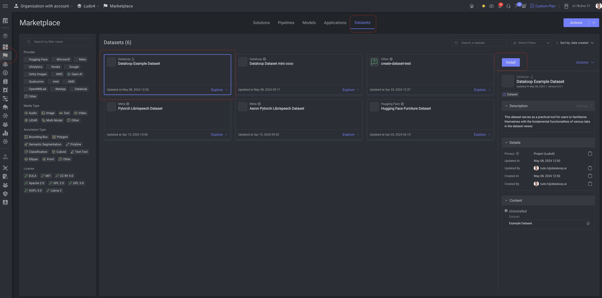
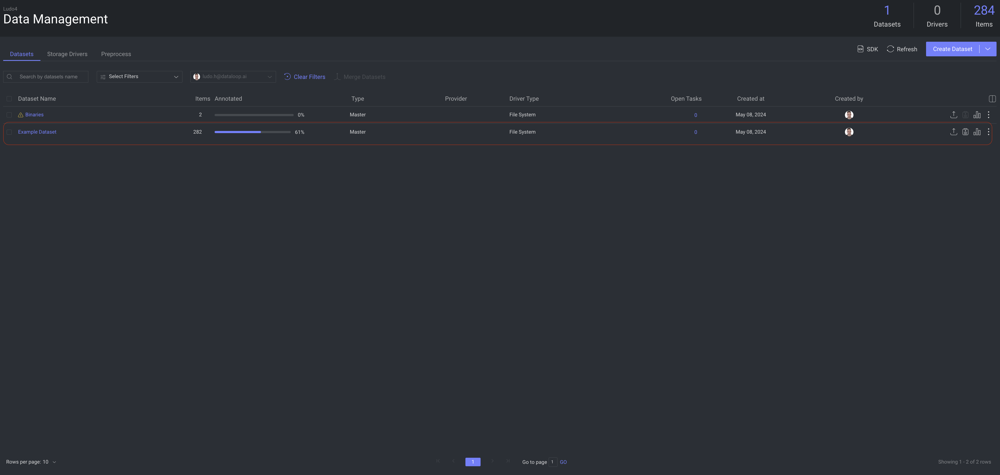

# Dataset adapter for Example Dataset

This dataset adapter is crafted to upload a sample dataset to the Dataloop platform. It serves as a practical tool for users to familiarize themselves with the fundamental functionalities of various tabs in the dataset viewer.

## Installation

1. Navigate to **Marketplace**.
2. Select **Datasets**.
3. Click on **Install**.

After a while, a new dataset will be created and visible under your **Data** section.

